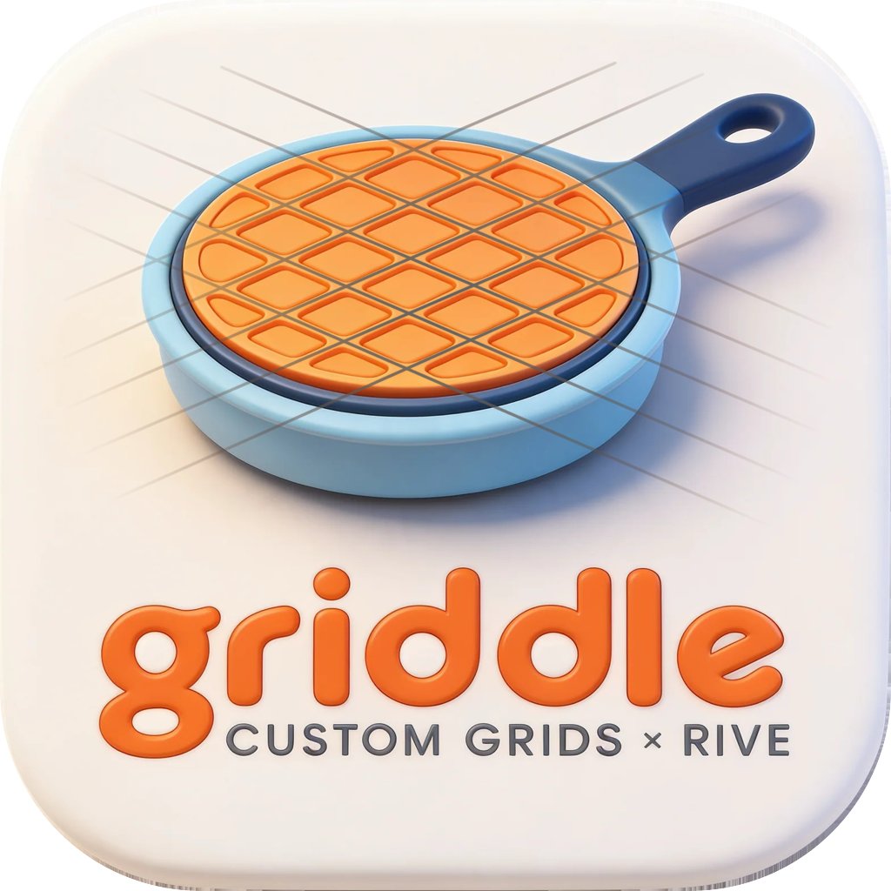

<p align="center"></p>

# Griddle

**Custom grids × Rive.** A tiny always-on-top panel that authors **snappable grid guides** directly in the Rive editor by talking to its MCP server — fully deterministic, no agent, no AI.

## Demo

https://github.com/user-attachments/assets/d84c0d76-1ec3-4a02-b21a-2ad90464b854

## Why

Script-rendered grids (node scripts, path effects) are computed at render time, so the Rive editor's vertex snapping never sees them. Griddle instead authors **real `PointsPath` geometry** through the editor's own MCP tooling: every grid line endpoint and lattice point is a genuine, snappable vertex.

## How it works

The Rive editor exposes an MCP server over HTTP at `http://127.0.0.1:9791/mcp` (streamable HTTP, stateless — a bare JSON-RPC `tools/call` works with no session handshake). Griddle:

1. Lets you pick a grid type and its properties (progressive disclosure — only the selected grid's parameters are shown).
2. Generates the grid geometry in plain JavaScript.
3. Assembles **one** `path_editor createShapes` tool call and POSTs it via a ~20-line Rust command.

## Grid types (14)

- **Cartesian:** Rectangular (+subdivisions, +cell gutters), Dot (snap crosses — the lattice point is a path vertex), Baseline (leading +subdivisions), Brick (offset running bond)
- **Angular:** Isometric (angle + optional verticals), Triangular, Diamond, Hexagonal (pointy-top honeycomb — shared row boundaries authored as single zigzag polylines, every hex corner snappable), Polar (concentric rings + spokes, movable center)
- **Perspective:** One-point (VP + horizon + receding floor lines), Two-point (two VPs, off-canvas positions allowed)
- **Composition:** Golden ratio (phi lines + spiral), Rule of thirds, Layout columns (count/gutter/margin)

Subdivisions mean "divide each cell into N parts" (N−1 minor lines; 0/1 = none).

## Features

- Artboard picker (auto-selects the active one) + auto-fit to artboard size
- Custom shape name (auto `Guides_<type>_N` if blank)
- Single shape + single styling by default; a **Separate subdivision style** toggle creates a grouped container with `_major`/`_sub` children so majors and minors get independent native strokes
- **True path metrics:** every segment path is authored open (Rive-created paths default to closed, which doubles measured path length — forward plus the closing chord), so dash effects and length-based tooling behave correctly on Griddle guides
- Path-count caps with auto-doubled spacing so a tiny cell can't flood the file
- **Remove last** deletes exactly the shapes it just created

## Install

Grab the latest [release](../../releases) (macOS dmg / Windows msi + nsis), or build from source:

```sh
cd src-tauri
cargo run              # dev
cargo build --release  # local binary
```

macOS builds are unsigned — right-click → **Open** on first launch, or:

```sh
xattr -dr com.apple.quarantine /Applications/Griddle.app
```

## Requirements

The Rive editor running with a file open (the MCP server rides on the editor at `127.0.0.1:9791`).

## MCP call format (for reference)

```json
POST http://127.0.0.1:9791/mcp
Content-Type: application/json
Accept: application/json, text/event-stream

{"jsonrpc":"2.0","id":1,"method":"tools/call",
 "params":{"name":"path_editor","arguments":{
   "command":"createShapes",
   "data":{"createShapes":{"shapes":[{
     "name":"Guides_rect_1","parentId":"<artboardId>","x":0,"y":0,
     "paints":[{"paintType":"stroke","width":1,"color":"#66808080"}],
     "paths":[{"name":"v0","commands":[
       {"commandType":"moveTo","x":0,"y":0},
       {"commandType":"lineTo","x":0,"y":1080}]}]}]}}}}}
```

## License

Copyright (c) 2026 IVG Design. Free to use, copy, modify, and distribute. Provided "as is" without warranty of any kind.
